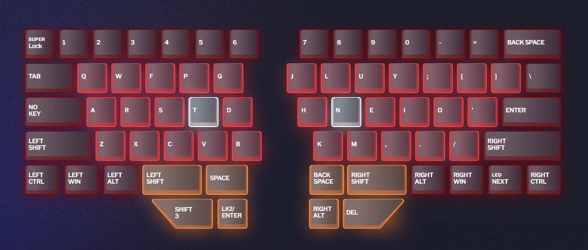
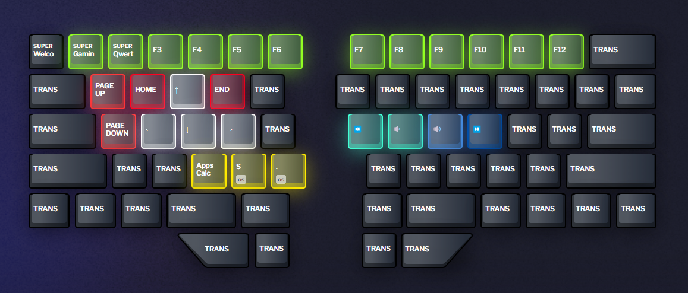
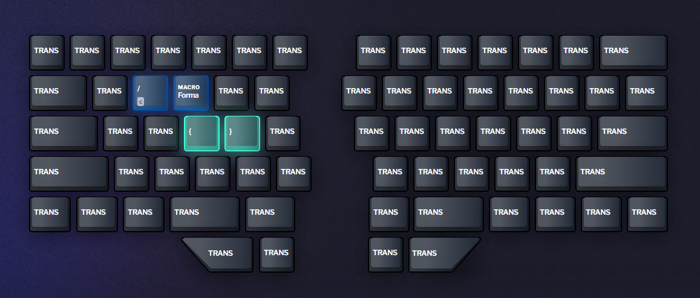
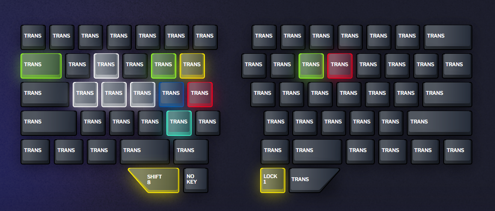
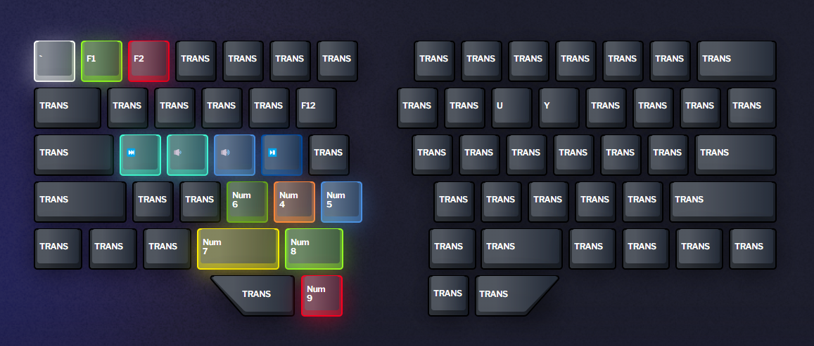
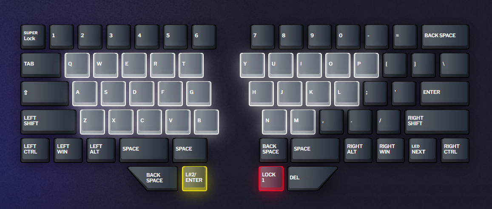

#  AllSortsOfStuff / 𝘙𝘢𝘪𝘴𝘦
My keyboard is a split ergonomic fully programmable mechanical keyboard.
Also known as the Dyma Raise 🥳

Here I store my layers.
#### Layer 1 --- Default Colemak

I use a Colemak layout rather than Qwerty. Other than that not too many crazy things going on.
The lower left two thumb keys I use for a quick temporary shift to layer 2 and layer 3.
The ESC key I can hold to lock my device.

---
#### Layer 2 --- Specials

This layer contains a bunch of functions I would regularly use, all in one layer.
It contains the arrow keys, home, end, page up & down. On the right side I have audio related keys.
The green bar are F1-F12 keys. F1 & F2 are dual functioning. On double presses they bring me to specific layers I might hold active for a longer period.
The ESC key functions as a tilde key as well as a grave accent.
The bottom three yellow keys are a bunch of quick access items, such as the calculater, Windows search and whatever the Emoji menu is called in Windows.

---
#### Layer 3 --- Development

A layer for a few development related actions, most likely to be expanded. 
It contains a more comfortable access to the `{}` keys. As well as a shortcut button to comment a section of code.
It also contains my favorite macro, a macro that triggers the VS Code formatter and then saves the file.

---
#### Layer 7 --- Gaming

The gaming layer isn't anything special, just the default 1 layer but with a different lighting scheme.

---
#### Layer 8 --- Gaming Utils

Considering I can split the Raise, I have a special layer for left handed actions only since the right half of the Raise would be disconnected to make more room for the mouse.

---
#### Layer 10 --- Qwerty

In case I do ever need the Qwerty layout I have a layer for it.